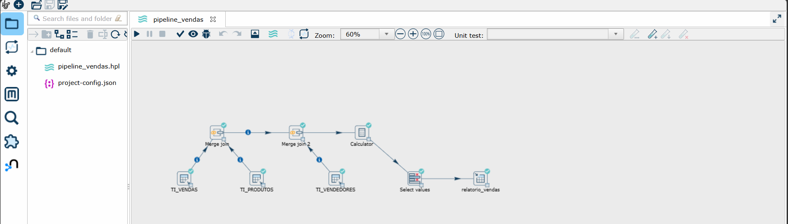
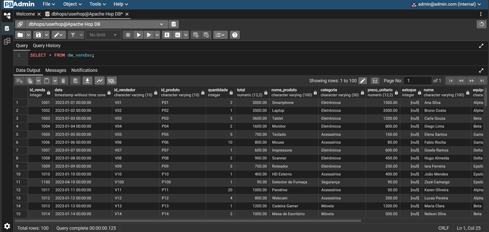

# 🚀 Projeto ETL: Integração de Vendas com Apache Hop & PostgreSQL

## 📝 Descrição do Projeto
Este projeto apresenta uma solução de **ETL (Extract, Transform, Load)** desenvolvida para aprendizado e consolidação de dados de vendas. O fluxo automatiza a extração de dados de três tabelas (Vendas, Produtos e Vendedores), aplica transformações para enriquecimento, realiza cálculos de faturamento e carrega os resultados em uma **Tabela Fato** pronta para análise de BI.

---

## 📂 Estrutura do Repositório
A organização das pastas segue os padrões de portabilidade do Apache Hop:

* **`/hop-projects`**: Contém o arquivo `.hpl` (pipeline) com a lógica do ETL.
* **`/hop-config`**: Arquivos de configuração de metadados e conexões de banco.
* **`/sql`**: Scripts SQL para a criação das tabelas originais e da tabela destino.
* **`docker-compose.yml`**: Arquivo para subir os serviços do Hop e Postgres via containers.

---

## 🛠️ Tecnologias Utilizadas
[](https://hop.apache.org/)
[](https://www.postgresql.org/)
[](https://www.docker.com/)

* **Apache Hop**: Orquestração e engenharia de dados.
* **PostgreSQL**: Banco de dados relacional para origem e destino.
* **Docker & Docker Compose**: Virtualização do ambiente.

---

## ⚙️ A Pipeline de ETL
O fluxo foi estruturado nas seguintes etapas:

1.  **Extração**: Captura de dados das tabelas `vendas`, `produtos` e `vendedores`.
2.  **Transformação**:
    * **Merge Join**: União das fontes para correlacionar vendas a produtos e vendedores.
    * **Calculator**: Cálculo do faturamento (`quantidade` × `preco_unitario`).
    * **Select Values**: Limpeza de colunas e formatação de datas (`yyyy-MM-dd`).
3.  **Carga**: Inserção dos dados processados na tabela consolidada `dw_vendas`.

---

## 🚀 Como Executar o Projeto

### 1. Preparar o Ambiente
Certifique-se de que o **Docker Desktop** está rodando no seu computador.

### 2. Subir os Containers
Abra o terminal na pasta raiz do projeto e execute:
```bash
docker-compose up -d
```

### 3. Configurar o Banco de Dados
Acesse seu cliente SQL (pgAdmin ou DBeaver) no `localhost:5432` e execute o script em `/sql/script_criacao.sql`.

### 4. Executar o Fluxo no Apache Hop
1. Abra o navegador em `http://localhost:8080`.
2. Carregue a pipeline localizada na pasta `/hop-projects`.
3. Clique no ícone de **Play (Launch)**.

---

## 📈 Resultados e Validação

### Fluxo Executado (Apache Hop)
Demonstração da pipeline finalizada com sucesso (steps com check verde ✅).



### Dados no Banco (PostgreSQL)
Consulta realizada no **pgAdmin** comprovando a integração e o cálculo correto dos dados.



| Desenvolvido por **Raycka Castro** 💻 com muuuuito ☕ !!
